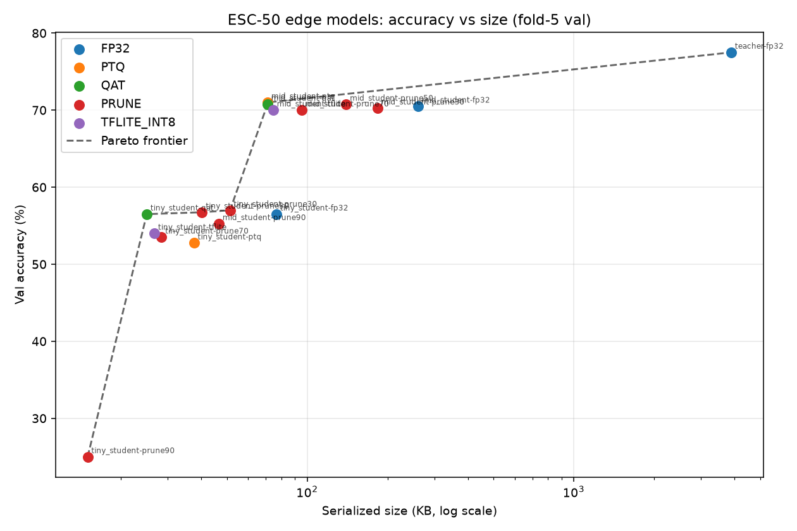

# Edge-ML Audio Compression Benchmark

An end-to-end model-compression pipeline for environmental sound
classification (ESC-50, 50 classes), built to answer one question rigorously:
*how small can you make an audio classifier before it stops being worth
deploying, and which compression technique gets you there?*

Knowledge distillation → INT8 quantization (PTQ and QAT, compared head-to-head)
→ magnitude pruning, swept across every model variant into an
accuracy/size/latency Pareto frontier, with a live React dashboard and a
deployment target of a ~$5 ESP32-S3 microcontroller.

Headline result: a 3.9 MB / 77.5% CNN teacher compressed to a 71 KB model at 70.8%
(55x smaller) and a 25 KB model at 56.5% (156x smaller).



## Key findings

1. Post-training quantization made the smallest model worse on both axes.
   TinyStudent (~17K params): 56.5% → 52.75% accuracy, and the file grew from
   19.3 KB to 37.6 KB. ONNX Runtime's QDQ format inserts scale/zero-point nodes
   around every op; below a certain parameter count that fixed per-op overhead
   outweighs the weight compression. Quantization has a size floor.

2. Quantization-aware training breaks through that floor. Distillation-aware
   FX-mode QAT holds TinyStudent at exactly its FP32 accuracy (56.5%) while
   shrinking it 3.06x to 25 KB. On the Pareto plot, tiny-QAT sits on the
   frontier; tiny-PTQ is strictly dominated. This finding drove the final
   deployment choice.

3. Pruning tolerance tracks over-parameterization. MidStudent (64K params)
   survives 70% sparsity with ~no accuracy loss; TinyStudent falls off a cliff
   past 50%. The model that resisted quantization is also the one near its
   capacity floor. That's consistent evidence, not coincidence.

## Results

ESC-50 standard protocol: folds 1-4 train, fold 5 validation. Full sweep in
[results/benchmark.json](results/benchmark.json).

| Variant | Params | Accuracy | Size | vs teacher |
|---|---|---|---|---|
| Teacher FP32 | 992,242 | 77.5% | 3.9 MB | 1× |
| MidStudent FP32 (distilled) | 63,826 | 70.5% | 260.5 KB | 15× |
| MidStudent INT8 QAT | 63,826 | **70.8%** | **70.9 KB** | **55×** |
| MidStudent prune 70% + fine-tune | — | 70.0% | 95.5 KB | 41× |
| TinyStudent FP32 (distilled) | 16,962 | 56.5% | 76.6 KB | 51× |
| TinyStudent INT8 PTQ | 16,962 | 52.75% | 37.6 KB (grew) | *dominated* |
| TinyStudent INT8 QAT | 16,962 | **56.5%** | **25.0 KB** | **156×** |
| Deployable TFLite INT8 (mid) | 63,826 | 70.0% | 74.5 KB | 52× |
| Deployable TFLite INT8 (tiny) | 16,962 | 54.0% | 26.7 KB | 146× |

Sizes are honest per format: FP32/QAT are (compressed) PyTorch state dicts, PTQ
is the ONNX file, TFLite is the flashable flatbuffer. Pruned sizes are
zlib-compressed state dicts, since unstructured pruning zeros weights without
shrinking dense tensors.

## Pipeline

```
ESC-50 wav ──► log-mel (64×216) ──► CNN teacher (992K params, 77.5%)
                                        │  knowledge distillation (T=4, α=0.7)
                            ┌───────────┴───────────┐
                      MidStudent (64K)        TinyStudent (17K)
                            │                       │
              ┌── PTQ (ONNX Runtime QDQ) ── vs ── QAT (FX fake-quant + KD loss) ──┐
              │                                                                   │
              ├── magnitude pruning 30/50/70/90% + KD fine-tune                   │
              │                                                                   │
              └────────► benchmark.py ──► Pareto frontier ──► dashboard ◄─────────┘
                                                                  ▲
                    ESP32-S3 (TFLite Micro, INT8) ── WebSocket ───┘
```

- **Distillation** — soft-target KD (temperature 4, α 0.7) from the teacher into
  two student capacities, chosen to straddle the "too small to compress?" question.
- **PTQ** — ONNX Runtime static quantization (QDQ, INT8 weights + activations),
  calibrated on training-fold features.
- **QAT** — PyTorch FX-graph fake-quantization fine-tuned **with the same
  distillation loss**, so the student optimizes for its quantized self under the
  teacher's guidance. Best-epoch selection happens on the fake-quant model;
  conversion to real INT8 happens exactly once.
- **Pruning** — global unstructured L1 magnitude pruning with KD fine-tune at
  30/50/70/90% sparsity.
- **Benchmark harness** — `scripts/benchmark.py` re-evaluates every variant and
  emits `results/benchmark.json` + the Pareto plot.
- **Dashboard** — zero-build React (no bundler) + stdlib-HTTP/WebSocket Python
  backend: Pareto scatter, full variant table, live inference stream.
  See [dashboard/README.md](dashboard/README.md).
- **ESP32-S3 deployment** — TFLite Micro firmware with a from-scratch C
  mel-spectrogram front end (framing, periodic Hann, radix-2 FFT, sparse mel
  filterbank, `power_to_db`), **A/B-validated off-board against the Python
  training pipeline to max|Δ| ≤ 0.0009, corr ≥ 0.99999**.
  See [esp32/README.md](esp32/README.md).

## Repo layout

```
scripts/     training, distillation, QAT, pruning, quantization, export, benchmark
results/     benchmark.json + pareto.png (the deliverable numbers)
dashboard/   React + WebSocket dashboard (zero-build) and Python server
esp32/       PlatformIO firmware: TFLite Micro + C DSP front end + host test harness
DECISIONS.md every decision, bug, dead end, and pivot — the engineering log
```

## Reproduce

Two venvs (TensorFlow has no Python 3.14 wheels, so conversion lives in 3.11):
`esc50env` (py3.14: torch, librosa, onnxruntime) and `tflite_env` (py3.11:
TF 2.21). Dataset: [ESC-50](https://github.com/karolpiczak/ESC-50) cloned as a
sibling directory.

```bash
python scripts/precompute_features.py   # log-mel feature cache
python scripts/train_teacher_v2.py      # 77.5% teacher
python scripts/distill_student_mid.py   # + distill_student.py for tiny
python scripts/quantize_onnxruntime.py  # PTQ
python scripts/qat_student.py           # QAT (the interesting one)
python scripts/prune_student.py         # sparsity sweep
python scripts/benchmark.py             # Pareto frontier
python dashboard/server.py --simulate   # dashboard at localhost:8000

# deployable INT8 TFLite (tflite_env): dump_weights.py -> convert_tflite_clean.py
# on-device front end: gen_mel_filterbank.py -> validate_mel_frontend.py
```

## On-device (ESP32-S3, measured on silicon)

The full pipeline (C mel front end → INT8 TFLite Micro inference) runs on an
ESP32-S3 (N16R8) and classifies real ESC-50 audio correctly on-device (verified
against the host tflite through the identical C DSP). All four rows measured on
the same board:

| Kernels | Model | Accuracy | Arena / location | Latency |
|---|---|---|---|---|
| reference | tiny | 54% | 137 KB / internal SRAM | 6.1 s |
| reference | mid | 70% | 273 KB / PSRAM | 22.5 s |
| esp-nn | tiny | 54% | 137 KB / internal SRAM | **143 ms** (43×) |
| **esp-nn** | **mid (deployed)** | **70%** | 273 KB / PSRAM | **416 ms** (54×) |

The story, in two moves ([DECISIONS.md M9-M10](DECISIONS.md)):

1. First bring-up said 6-22 s, not the ~300 ms I'd estimated. The initial
   TFLite-Micro library shipped only reference (non-SIMD) kernels, and the
   higher-accuracy mid model's 273 KB arena doesn't fit internal SRAM (→ PSRAM,
   bandwidth-bound). That's the accuracy/latency/memory trilemma, on real silicon.
2. esp-nn dissolved it. Swapping to Espressif's `esp-tflite-micro` + esp-nn
   (ESP32-S3 SIMD assembly kernels) gave a 43-54x speedup. The mid model, the
   70% one that was "too slow / doesn't fit fast RAM", now runs at 416 ms from
   PSRAM. So the deployed model is mid at full accuracy and real-time speed; tiny at
   143 ms is the low-latency option. On an MCU, the kernel implementation matters as
   much as the model.

Live microphone input: an INMP441 I2S MEMS mic drives the full on-device
pipeline (I2S capture → C mel front end → esp-nn INT8 inference) at ~1.3 s/inference,
and the predictions stream mic → USB serial → WebSocket → the React dashboard, live
in the browser. Two on-board fixes got it there ([DECISIONS.md M11](DECISIONS.md)):
the pre-board pin map used a GPIO that's a bonded flash line on the S3 (GPIO26-37 are
flash/PSRAM), and the I2S gain was calibrated from a measured peak/RMS readout
(`>>14` clipped loud transients; `>>15` gives headroom, and the mel front end's
`power_to_db(ref=max)` + z-norm make it gain-invariant anyway, so the shift only has
to avoid clipping). It responds sensibly to real sound: a clap reads as `fireworks`,
a knock as `door_wood_knock`.

## Status

Complete, end to end on hardware: compression sweep, deployment on the ESP32-S3,
the 70% model at 416 ms via esp-nn, and a live INMP441 microphone driving real-time
inference into the dashboard. The full engineering log is in
[DECISIONS.md](DECISIONS.md): why PTQ was measured two
ways, the TensorFlow SavedModel hang that forced a Keras-rebuild conversion path,
the on-device RAM/latency tradeoff, the 54x esp-nn kernel win that flipped the
deploy decision, the I2S pin/gain calibration, and every negative result.
Optional future work: WiFi bridge (vs USB serial),
structured pruning for dense speedups, mic-side AGC/denoise.
